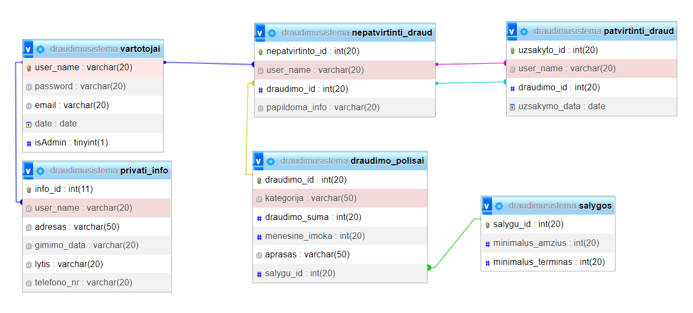

# Insurance Company System
Simple project that I did a few years ago for my class, developed using plain PHP and SQL, with minimal use of Python for PHPMailer.

# Project Overview
This project aims to create a user-friendly and accessible server program for an insurance company, along with designing the database and developing a prototype of the client-server program. Upon registration, users will be able to order their desired insurance policies.

## Project Goals
The primary objective is to provide people with a tool that offers insurance services, allowing them to easily order suitable insurance from the comfort of their homes. The deployment of the server program will be made understandable without requiring extensive technical knowledge, and the program will be accessible from any phone or computer.

## System Functionality
- <b>User Authentication:</b> Users can register and log in to the server program. Passwords are encrypted for security.
- <b>Insurance Selection:</b> Users can choose appropriate insurance from a provided list.
- <b>Insurance Ordering:</b> Users can place orders for insurance.
- <b>Insurance Management:</b> Functionality to create, edit, and delete insurance policies.
- <b>User Management:</b> Ability to create, edit, and delete user accounts.
- <b>Functional Search:</b> Implementation of a search feature for ease of navigation.
- <b>Password Encryption and Decryption:</b> Passwords are encrypted for storage in the database and decrypted for authentication purposes, ensuring user data security.
- <b>Automated Email Sender:</b> Integration of automated email sending functionality for notifications, confirmations, and communication with users.

## Technologies Used
- <b>Database:</b> MySQL
- <b>Back-end:</b> PHP
- <b>Front-end:</b> HTML/CSS/JavaScript

## Setup Instructions
- Install XAMPP and start the Apache and MySQL services.
- Import the provided SQL file into your MySQL database.
- Clone this repository to your local machine.
- Place the project files in the appropriate directory (usually htdocs in XAMPP).
- Open the project in your preferred code editor.
- Modify the database connection settings in the PHP files to match your local environment.
- Access the project through your web browser.

## Database model

